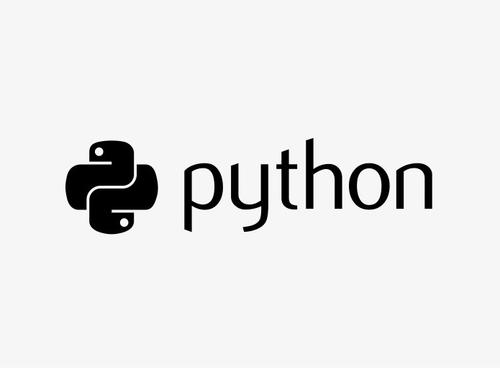

# PythonBasic

python基础知识部分资源来源于自我收集和学习笔记,若有侵权请留言！

## 1.python基础知识

[1.计算机基础知识](./book/1.python基础知识/1.计算机基础知识.md)

[2.认识python](./book/1.python基础知识/2.认识python.md)

[3.第一个python程序](./book/1.python基础知识/3.第一个python程序.md)

[4.注释](./book/1.python基础知识/4.注释.md)

[5.变量和数据类型](./book/1.python基础知识/5.变量和数据类型.md)

[6.标识符和关键词](./book/1.python基础知识/6.标识符和关键词.md)

[7.输出](./book/1.python基础知识/7.输出.md)

[8.输入](./book/1.python基础知识/8.输入.md)

[9.运算符](./book/1.python基础知识/9.运算符.md)

[10.数据类型转换](./book/1.python基础知识/10.数据类型转换.md)

## 2.python基本语法

[1.判断语法if](./book/2.python基本语法/1.判断语法if.md)

[2.判断语法if-else](./book/2.python基本语法/2.判断语法if-else.md)

[3.判断语法elif](./book/2.python基本语法/3.判断语法elif.md)

[4.判断语法if嵌套](./book/2.python基本语法/4.判断语法if嵌套.md)

[5.判断语法补充知识](./book/2.python基本语法/5.判断语法补充知识.md)

[6.判断语法比较、关系运算符](./book/2.python基本语法/6.判断语法比较、关系运算符.md)

[7.循环语法while](./book/2.python基本语法/7.循环语法while.md)

[8.循环语法break和continue](./book/2.python基本语法/8.循环语法break和continue.md)

[9.循环语法while嵌套](./book/2.python基本语法/9.循环语法while嵌套.md)

[10.循环语法for](./book/2.python基本语法/10.循环语法for.md)

## 3.pytho基本数据类型

[1.字符串](./book/3.python基本数据类型/1.字符串.md)

[2.字符串常见操作](./book/3.python基本数据类型/2.字符串常见操作.md)

[3.列表](./book/3.python基本数据类型/3.列表.md)

[4.元组](./book/3.python基本数据类型/4.元组.md)

[5.字典](./book/3.python基本数据类型/5.字典.md)

[6.公共方法](./book/3.python基本数据类型/6.公共方法.md)

## 4.python函数（一）

[1.函数介绍](./book/4.python函数（一）/1.函数介绍.md)

[2.函数的参数](./book/4.python函数（一）/2.函数的参数.md)

[3.函数的类型](./book/4.python函数（一）/3.函数的类型.md)

[4.函数的嵌套调用](./book/4.python函数（一）/4.函数的嵌套调用.md)

## 5.python函数（二）

[1.python函数中的变量](./book/5.python函数（二）/1.python函数的变量.md)

[2.python函数的特性](./book/5.python函数（二）/2.python函数的特性.md)

[3.python函数的特殊化处理](./book/5.python函数（二）/3.python函数的特殊化处理.md)

[4.python函数内存知识补充](./book/5.python函数（二）/4.python函数内存知识补充.md)

[5.python函数使用注意事项](./book/5.python函数（二）/5.python函数使用注意事项.md)

## 6.python补充知识

[1.递归函数和匿名函数](./book/6.python知识扩充/1.递归函数和匿名函数.md)

[2.python推导式](./book/6.python知识扩充/2.python推导式.md)

[3.set、list、tuple](./book/6.python知识扩充/3.set、list、tuple.md)

[4.其他补充](./book/6.python知识扩充/4.其他补充.md)

## 7.python文件IO流

[1.python文件操作](./book/7.python文件IO流/1.python文件操作.md)

[2.python文件和文件夹操作](./book/7.python文件IO流/2.文件和文件夹操作.md)

## 8.python面向对象基础（一）

[1.面向对象介绍](./book/8.python面向对象基础（一）/1.面向对象介绍.md)

[2.类的定义和对象创建](./book/8.python面向对象基础（一）/2.类的定义和对象创建.md)

[3.\__init__方法](./book/8.python面向对象基础（一）/3.__init__方法.md)

[4.\__str__方法](./book/8.python面向对象基础（一）/4.__str__方法.md)

[5.\__del__方法](./book/8.python面向对象基础（一）/5.__del__方法.md)

## 9.python面向对象基础（二）

[1.继承](./book/9.python面向对象基础（二）/1.继承.md)

[2.子类重写父类的同名属性和方法](./book/9.python面向对象基础（二）/2.子类重写父类的同名属性和方法.md)

[3.子类调用父类的同名属性和方法](./book/9.python面向对象基础（二）/3.子类调用父类同名属性和方法.md)

[4.多层继承](./book/9.python面向对象基础（二）/4.多层继承.md)

[5.通过super()来调用父类的方法](./book/9.python面向对象基础（二）/5.通过super()来调用父类方法.md)

[6.知识点小结](./book/9.python面向对象基础（二）/6.知识点小结.md)

## 10.python面向对象基础（三）

[1.私有化属性和方法](./book/10.python面向对象基础（三）/1.私有化属性和方法.md)

[2.多态](./book/10.python面向对象基础（三）/2.多态.md)

[3.类属性和实例属性](./book/10.python面向对象基础（三）/3.类属性和实例属性.md)

[4.类方法和静态方法](./book/10.python面向对象基础（三）/4.类方法和静态方法.md)

[5.\_\_new__()方法](./book/10.python面向对象基础（三）/5.__new__()方法.md)

[6.设计模式：单例设计模式](./book/10.python面向对象基础（三）/6.设计模式:单例设计模式.md)

## 11.python异常、模块、包

[1.异常](./book/11.python异常、模块/1.异常.md)

[2.异常传递和抛出](./book/11.python异常、模块/2.异常传递和抛出.md)

[3.模块和包](./book/11.python异常、模块/3.模块和包.md)

[4.模块制作](./book/11.python异常、模块/4.模块制作.md)

[5.python中的包](./book/11.python异常、模块/5.python中的包.md)

至此python基础内容已全部跟新完成，下面开始更新python高级用法部分

