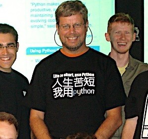

# 认识python(了解)

## 一、Python发展背景

- Python的作者，Guido von Rossum（吉多·范·罗苏姆，中国Python程序员都叫他 龟叔），荷兰人。1982年，龟叔从阿姆斯特丹大学获得了数学和计算机硕士学位。然而，尽管他算得上是一位数学家，但他更加享受计算机带来的乐趣。用他的话说，虽然拥有数学和计算机双料资质，他总趋向于做计算机相关的工作，并热衷于做任何和编程相关的事情。

- 在那个时候，龟叔接触并使用过诸如Pascal、C、Fortran等语言。这些语言的基本设计原则是让机器能更快运行。在80年代，虽然IBM和苹果已经掀起了个人电脑浪潮，但这些个人电脑的配置很低。比如早期的Macintosh，只有8MHz的CPU主频和128KB的RAM，一个大的数组就能占满内存。所有的编译器的核心是做优化，以便让程序能够运行。为了增进效率，语言也迫使程序员像计算机一样思考，以便能写出更符合机器口味的程序。在那个时代，程序员恨不得用手榨取计算机每一寸的能力。有人甚至认为C语言的指针是在浪费内存。至于动态类型，内存自动管理，面向对象…… 别想了，那会让你的电脑陷入瘫痪。

- 这种编程方式让龟叔感到苦恼。龟叔知道如何用C语言写出一个功能，但整个编写过程需要耗费大量的时间，即使他已经准确的知道了如何实现。他的另一个选择是shell。Bourne Shell作为UNIX系统的解释器已经长期存在。UNIX的管理员们常常用shell去写一些简单的脚本，以进行一些系统维护的工作，比如定期备份、文件系统管理等等。shell可以像胶水一样，将UNIX下的许多功能连接在一起。许多C语言下上百行的程序，在shell下只用几行就可以完成。然而，shell的本质是调用命令。它并不是一个真正的语言。比如说，shell没有数值型的数据类型，加法运算都很复杂。总之，shell不能全面的调动计算机的功能。

- 龟叔希望有一种语言，这种语言能够像C语言那样，能够全面调用计算机的功能接口，又可以像shell那样，可以轻松的编程。ABC语言让龟叔看到希望。ABC是由荷兰的数学和计算机研究所开发的。龟叔在该研究所工作，并参与到ABC语言的开发。ABC语言以教学为目的。与当时的大部分语言不同，ABC语言的目标是“让用户感觉更好”。ABC语言希望让语言变得容易阅读，容易使用，容易记忆，容易学习，并以此来激发人们学习编程的兴趣。比如下面是一段来自Wikipedia的ABC程序，这个程序用于统计文本中出现的词的总数：

    ```bash
       HOW TO RETURN words document:
          PUT {} IN collection
          FOR line IN document:
             FOR word IN split line:
                IF word not.in collection:
                   INSERT word IN collection
          RETURN collection
    ```

- HOW TO用于定义一个函数。一个Python程序员应该很容易理解这段程序。ABC语言使用冒号和缩进来表示程序块。行 尾没有分号。for和if结构中也没有括号() 。赋值采用的是PUT，而不是更常见的等号。这些改动让ABC程序读起来像一段文字。

- 尽管已经具备了良好的可读性和易用性，ABC语言最终没有流行起来。在当时，ABC语言编译器需要比较高配置的电脑才能运行。而这些电脑的使用者通常精通计算机，他们更多考虑程序的效率，而非它的学习难度。除了硬件上的困难外，ABC语言的设计也存在一些致命的问题：

    - 可拓展性差。ABC语言不是模块化语言。如果想在ABC语言中增加功能，比如对图形化的支持，就必须改动很多地方。
    - 不能直接进行IO。ABC语言不能直接操作文件系统。尽管你可以通过诸如文本流的方式导入数据，但ABC无法直接读写文 件。输入输出的困难对于计算机语言来说是致命的。你能想像一个打不开车门的跑车么？
    - 过度革新。ABC用自然语言的方式来表达程序的意义，比如上面程序中的HOW TO 。然而对于程序员来说，他们更习惯 用function或者define来定义一个函数。同样，程序员更习惯用等号来分配变量。尽管ABC语言很特别，但学习难度 也很大。
    - 传播困难。ABC编译器很大，必须被保存在磁带上。当时龟叔在访问的时候，就必须有一个大磁带来给别人安装ABC编 译器。 这样，ABC语言就很难快速传播。

- 1989年，为了打发圣诞节假期，龟叔开始写Python语言的编译器。Python这个名字，来自龟叔所挚爱的电视剧Monty Python's Flying Circus。他希望这个新的叫做Python的语言，能符合他的理想：创造一种C和shell之间，功能全面，易学易用，可拓展的语言。龟叔作为一个语言设计爱好者，已经有过设计语言的尝试。这一次，也不过是一次纯粹的hacking行为。

## 二、Python语言的诞生

- 1991年，第一个Python编译器诞生。它是用C语言实现的，并能够调用C语言的库文件。从一出生，Python已经具有了 ：类，函数，异常处理，包含表和词典在内的核心数据类型，以及模块为基础的拓展系统。

- Python语法很多来自C，但又受到ABC语言的强烈影响。来自ABC语言的一些规定直到今天还富有争议，比如强制缩进。 但这些语法规定让Python容易读。另一方面，Python聪明的选择服从一些惯例，特别是C语言的惯例，比如回归等号赋值。龟叔认为，如果“常识”上确立的东西，没有必要过度纠结。

- Python从一开始就特别在意可拓展性。Python可以在多个层次上拓展。从高层上，你可以直接引入. py文件。在底层，你可以引用C语言的库。Python程序员可以快速的使用Python写. py文件作为拓展模块。但当性能是考虑的重要因素时，Python程序员可以深入底层，写C程序，编译为.so文件引入到Python中使用。Python就好像是使用钢构建房一样，先规定好大的框架。而程序员可以在此框架下相当自由的拓展或更 改。

- 最初的Python完全由龟叔本人开发。Python得到龟叔同事的欢迎。他们迅速的反馈使用意见，并参与到Python的改进。龟叔和一些同事构成Python的核心团队。他们将自己大部分的业余时间用于hack Python。随后，Python拓 展到研究所之外。Python将许多机器层面上的细节隐藏，交给编译器处理，并凸显出逻辑层面的编程思考。Python程 序员可以花更多的时间用于思考程序的逻辑，而不是具体的实现细节。这一特征吸引了广大的程序员。Python开始流行。

    

> 人生苦短，我用python

- 计算机硬件越来越强大，Python又容易使用，所以许多人开始转向Python。龟叔维护了一个mail list，Python用户就通过邮件进行交流。Python用户来自许多领域，有不同的背景，对Python也有不同的需求。Python相当的开放，又容 易拓展，所以当用户不满足于现有功能，很容易对Python进行拓展或改造。随后，这些用户将改动发给龟叔，并由龟叔决定是否将新的特征加入到Python或者标准库中。如果代码能被纳入Python自身或者标准库，这将极大的荣誉。由于龟叔至高无上的决定权，他因此被称为“终身的仁慈独裁者”。
- Python以及其标准库的功能强大。这些是整个社区的贡献。Python的开发者来自不同领域，他们将不同领域的优点带给Python。比如Python标准库中的正则表达是参考Perl，而lambda, map, filter, reduce等函数参考了Lisp。Python本身的一些功能以及大部分的标准库来自于社区。Python的社 区不断扩大，进而拥有了自己的newsgroup，网站，以及基金。从Python 2.0开始，Python也从mail list的开发方式，转为完全开源的开发方式。社区气氛已经形成，工作被整个社区分担，Python也获得了更加高速的发展。
- 到今天，Python的框架已经确立。Python语言以对象为核心组织代码，支持多种编程范式，采用动态类型，自动进行内存回收。Python支持解释运行，并能调用C库进行拓展。Python有强大的标准库。由于标准库的体系已经稳定，所以Python的生态系统开始拓展到第三方包。这些包，如Django、web.py、wxpython、numpy、matplotlib、PIL，将Python升级成了物种丰富的热带雨林。
- Python崇尚优美、清晰、简单，是一个优秀并广泛使用的语言。Python在TIOBE排行榜中排行第八，它是Google的第三大开发语言，Dropbox的基础语言，豆瓣的服务器语言。Python的发展史可以作为一个代表，带给我许多启示。
- 在Python的开发过程中，社区起到了重要的作用。龟叔自认为自己不是全能型的程序员，所以他只负责制订框架。如果问题太复杂，他会选择绕过去，也就是cut the corner。这些问题最终由社区中的其他人解决。社区中的人才是异常丰富的，就连创建网站，筹集基金这样与开发稍远的事情，也有人乐意于处理。如今的项目开发越来越复杂，越来越庞大，合作以及开放的心态成为项目最终成功的关键。
- Python从其他语言中学到了很多，无论是已经进入历史的ABC，还是依然在使用的C和Perl，以及许多没有列出的其他 语言。可以说，Python的成功代表了它所有借鉴的语言的成功。同样，Ruby借鉴了Python，它的成功也代表了Python某些方面的成功。每个语言都是混合体，都有它优秀的地方，但也有各种各样的缺陷。同时，一个语言“好与不好”的评判，往往受制于平台、硬件、时代等等外部原因。程序员经历过许多语言之争。其实，以开放的心态来接受各个语言，说不定哪一天，程序员也可以如龟叔那样，混合出自己的语言。

## 三、关键点常识

- Python的发音与拼写
- Python的作者是Guido van Rossum（龟叔）
- Python正式诞生于1991年
- Python的解释器如今有多个语言实现，我们常用的是CPython（官方版本的C语言实现），其他还有Jython（可以运行在Java平台）、IronPython（可以运行在.NET和Mono平台）、PyPy（Python实现的，支持JIT即时编译）
- Python目前有两个版本，Python2和Python3，最新版分别为2.7.13和3.6.2
- Life is shot, you need Python. 人生苦短，我用Python。

## 四、Python优缺点

### 优点

- 简单：Python是一种代表简单主义思想的语言。阅读一个良好的Python程序就感觉像是在读英语一样，尽管这个英语的要求非常严格！Python的这种伪代码本质是它最大的优点之一。它使你能够专注于解决问题而不是去搞明白语言本身。
- 易学：就如同你即将看到的一样，Python极其容易上手。前面已经提到了，Python有极其简单的语法。
- 免费、开源：Python是FLOSS（自由/开放源码软件）之一。简单地说，你可以自由地发布这个软件的拷贝、阅读它的源代码、对它做改动、把它的一部分用于新的自由软件中。FLOSS是基于一个团体分享知识的概念。这是为什么Python如此优秀的原因之一——它是由一群希望看到一个更加优秀的Python的人创造并经常改进着的。
- 高层语言：当你用Python语言编写程序的时候，你无需考虑诸如如何管理你的程序使用的内存一类的底层细节。
- 可移植性：由于它的开源本质，Python已经被移植在许多平台上（经过改动使它能够工作在不同平台上）。如果你小心地避免使用依赖于系统的特性，那么你的所有Python程序无需修改就可以在下述任何平台上面运行。这些平台包括Linux、Windows、FreeBSD、Macintosh、Solaris、OS/2、Amiga、AROS、AS/400、BeOS、OS/390、z/OS、Palm OS、QNX、VMS、Psion、Acom RISC OS、VxWorks、PlayStation、Sharp Zaurus、Windows CE甚至还有PocketPC、Symbian以及Google基于linux开发的Android平台！
- 解释型语言：一个用编译型语言比如C或C++写的程序可以从源文件（即C或C++语言）转换到一个你的计算机使用的语言（二进制代码，即0和1）。这个过程通过编译器和不同的标记、选项完成。当你运行你的程序的时候，连接/转载器软件把你的程序从硬盘复制到内存中并且运行。而Python语言写的程序不需要编译成二进制代码。你可以直接从源代码运行程序。在计算机内部，Python解释器把源代码转换成称为字节码的中间形式，然后再把它翻译成计算机使用的机器语言并运行。事实上，由于你不再需要担心如何编译程序，如何确保连接转载正确的库等等，所有这一切使得使用Python更加简单。由于你只需要把你的Python程序拷贝到另外一台计算机上，它就可以工作了，这也使得你的Python程序更加易于移植。
- 面向对象：Python既支持面向过程的编程也支持面向对象的编程。在“面向过程”的语言中，程序是由过程或仅仅是可重用代码的函数构建起来的。在“面向对象”的语言中，程序是由数据和功能组合而成的对象构建起来的。与其他主要的语言如C++和Java相比，Python以一种非常强大又简单的方式实现面向对象编程。
- 可扩展性：如果你需要你的一段关键代码运行得更快或者希望某些算法不公开，你可以把你的部分程序用C或C++编写，然后在你的Python程序中使用它们。
- 丰富的库：Python标准库确实很庞大。它可以帮助你处理各种工作，包括正则表达式、文档生成、单元测试、线程、数据库、网页浏览器、CGI、FTP、电子邮件、XML、XML-RPC、HTML、WAV文件、密码系统、GUI（图形用户界面）、Tk和其他与系统有关的操作。记住，只要安装了Python，所有这些功能都是可用的。这被称作Python的“功能齐全”理念。除了标准库以外，还有许多其他高质量的库，如wxPython、Twisted和Python图像库等等。
- 规范的代码：Python采用强制缩进的方式使得代码具有极佳的可读性。

### 缺点

Python语言非常完善，没有明显的短板和缺点，唯一的缺点就是执行效率慢，这个是解释型语言所通有的，同时这个缺点也将被计算机越来越强大的性能所弥补。

## 五、Python应用场景

- **Web应用开发**

    Python经常被用于Web开发。比如，通过mod_wsgi模块，Apache可以运行用Python编写的Web程序。Python定义了WSGI标准应用接口来协调Http服务器与基于Python的Web程序之间的通信。一些Web框架，如Django,TurboGears,web2py,Zope等，可以让程序员轻松地开发和管理复杂的Web程序。

- **操作系统管理、服务器运维的自动化脚本**

    在很多操作系统里，Python是标准的系统组件。 大多数Linux发行版以及NetBSD、OpenBSD和Mac OS X都集成了Python，可以在终端下直接运行Python。有一些Linux发行版的安装器使用Python语言编写，比如Ubuntu的Ubiquity安装器,Red Hat Linux和Fedora的Anaconda安装器。Gentoo Linux使用Python来编写它的Portage包管理系统。Python标准库包含了多个调用操作系统功能的库。通过pywin32这个第三方软件 包，Python能够访问Windows的COM服务及其它Windows API。使用IronPython，Python程序能够直接调用.Net Framework。一般说来，Python编写的系统管理脚本在可读性、性能、代码重用度、扩展性几方面都优于普通的shell脚本。

- **网络爬虫**

    Python有大量的HTTP请求处理库和HTML解析库，并且有成熟高效的爬虫框架Scrapy和分布式解决方案scrapy-redis，在爬虫的应用方面非常广泛。

- **科学计算**

    NumPy、SciPy、Pandas、Matplotlib可以让Python程序员编写科学计算程序。

- **桌面软件**

    PyQt、PySide、wxPython、PyGTK是Python快速开发桌面应用程序的利器。

- **服务器软件（网络软件）**

    Python对于各种网络协议的支持很完善，因此经常被用于编写服务器软件、网络爬虫。第三方库Twisted支持异步网络编程和多数标准的网络协议(包含客户端和服务器)，并且提供了多种工具，被广泛用于编写高性能的服务器软件。

- **游戏**

    很多游戏使用C++编写图形显示等高性能模块，而使用Python或者Lua编写游戏的逻辑、服务器。相较于Python，Lua的功能更简单、体积更小；而Python则支持更多的特性和数据类型。

- **构思实现，产品早期原型和迭代**

    Google、NASA、Facebook都在内部大量地使用Python。