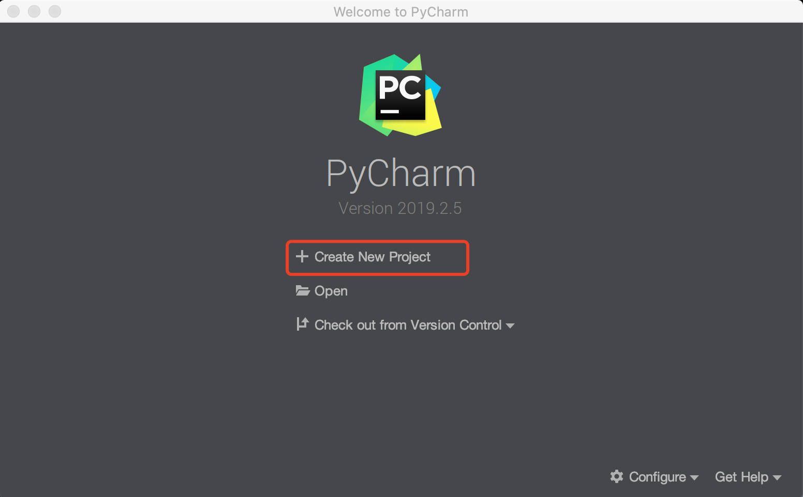
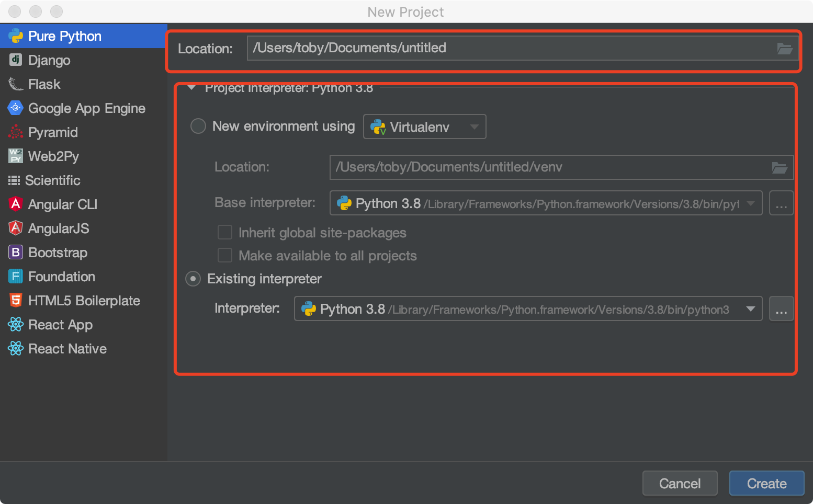
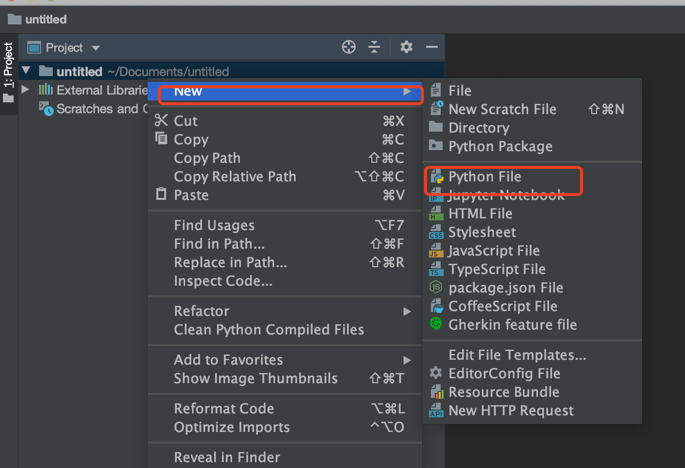
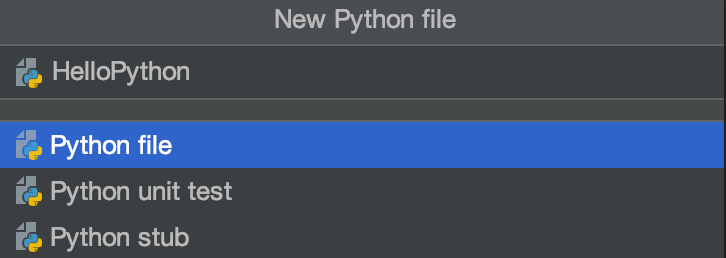
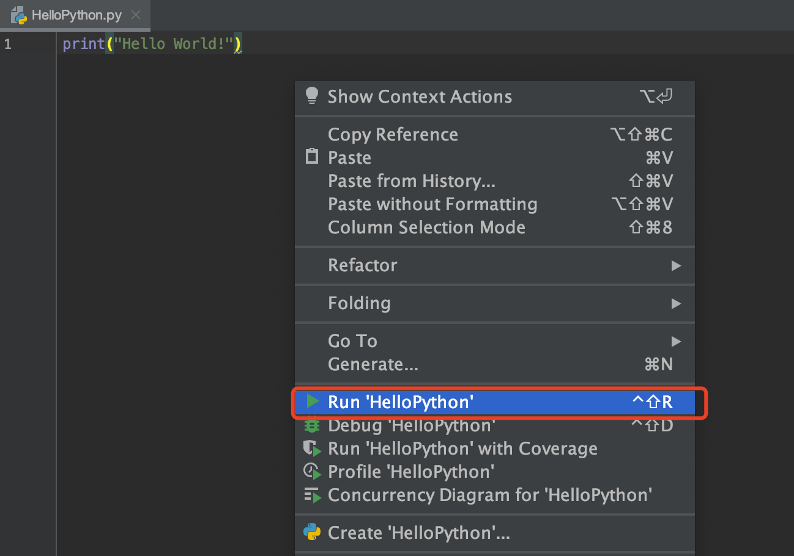
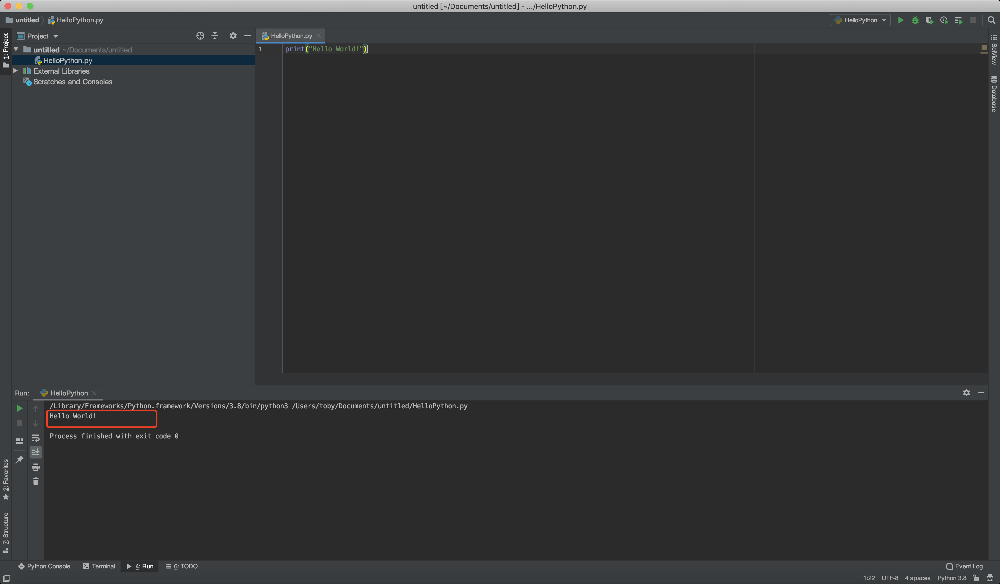

# 第一个python程序

## pycharm介绍

PyCharm是一种PythonIDE，带有一整套可以帮助用户在使用Python语言开发时提高其效率的工具，比如调试、语法高亮、Project管理、代码跳转、智能提示、自动完成、单元测试、版本控制。此外，该IDE提供了一些高级功能，以用于支持Django框架下的专业Web开发。

## 使用pycharm写出第一个程序

1. 打开 Pycharm，选择 `Create New Project`，创建一个新项目 

2. 选择`Pure Python`表示创建一个纯Python程序项目, `Location` 表示该项目保存的路径，`Project Interpreter` 表示使用的Python解释器版本，最后点击`Create` 创建项目。

3. 右击项目，选择`New`，再选择`Python File` 

4. 在弹出的对话框中输入的文件名HelloPython，点击`OK`，表示创建一个Python程序的文本文件，文本文件后缀名默认.py

5. 输入以下代码，并右击空白处，选择`Run`运行，表示打印一个字符串"Hello World!"。

    ```python
    print("Hello World!")
    ```

    

6. 运行成功后，Pycharm Console窗口将显示我们的输出结果。

    